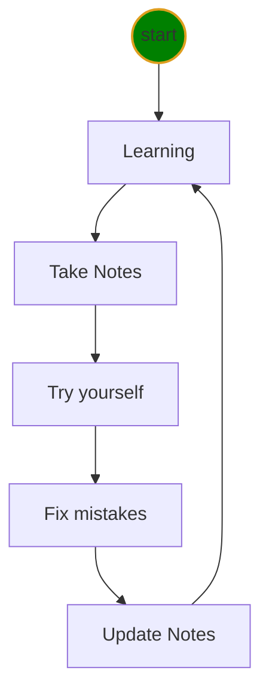
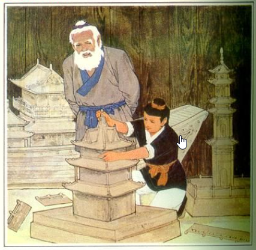

# Python class level-I Notes

1. 🔥[Python Program](doc/python.md)
2. [Markdown Tricks](doc/markdownTricks.md)
3. [Software Installation](doc/pythonInstall.md)
4. [VSCode Tricks](doc/vscodeTricks.md)
5. [Keyboard](doc/keyboard.md)
6. ❌[Mistakes](doc/mistakes.md)
7. [Icons](doc/myIcons.md)
8. ❓[✔️QA](doc/questionAnswer.md)


## file structure 
```output
<project root>
    ├── 📝doc/
    |    ├── mistakes.md 
    |    ├── vscodeTrics.md 
    |    └── python.md 
    ├── 🔨homeworks/
    |       └── <filenameXX.md>
    ├── 🔥src/
    |      └── hello.py 
    └── 👉ReadMe.md
```
## Learning Cycle


[鲁班学艺](https://mp.weixin.qq.com/s?src=3&timestamp=1625747665&ver=1&signature=h22W-N48A9UE06FGritPe-MgUaG6QDN6zUN*aLP*Oq0ekWJ-cq4TvS3VOgcHI1ZLcO7R*8JM0Lfujq3QTUrKvdXEJLn2ZUlZ7P1NWA8ngESieQwJsqMC3lmmErp5vxKH37lyt8cRs2M96M8yS1CB-D90V2GuZ7nD82ytgLhqn9o=)

鲁班苦学了三年，把所有的手艺都学会了。老师傅还要试试他，把模型全部毁掉，让他重新造。他凭记忆，一件一件都造得跟原来的一模一样。老师傅又提出好多新模型让他造。他一边琢磨一边做，结果都按师傅说的式样做出来了。老师傅非常满意。



Everything you have learned, you need do it all by yourself, until then, whatever you've learned indeed belongs to yourself.
  


