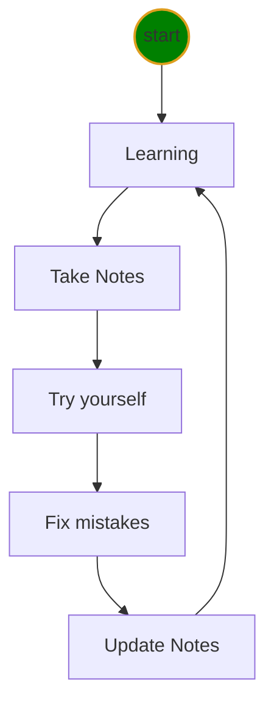

# Python class level-I Notes

* [Markdown Tricks](doc/markdownTricks.md)
* [Software Installation](doc/installation.md)
* [Python Program](doc/python.md)
* [VSCode Tricks](doc/vscodeTricks.md)
* 👍[QA](doc/questionAnswer.md)

Repository
## Learning Cycle
