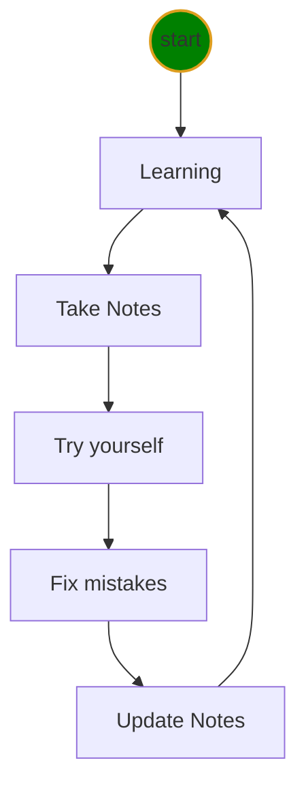

# Python class level-I Notes

[Markdown doc](https://www.markdownguide.org/cheat-sheet)

## Check Installation
* check python
```DOS
python --version
```
* check vscode
  
    Desktop > double click Visual Studio Code icon

## My First python program
```py
print("Hello, world!")
```
## VS Code tricks

* open terminal
* open python playground
```DOS
python
```
I will get prompt below
```
C:\Users\12818\workspace\python1>python
Python 3.9.1 (tags/v3.9.1:1e5d33e, Dec  7 2020, 17:08:21) [MSC v.1927 64 bit (AMD64)] on win32
Type "help", "copyright", "credits" or "license" for more information.
>>>
```

## Errors
### ❌cannot open image in markdown preview
* ✔️Solution: move **keyboard.md** under **doc/** folder.

### ❓Why my cls command does NOT work?


### ❌Python sytax error
```output
  File "c:\Users\12818\workspace\python1\hello.py", line 1
    print("the area of rectangle is "%d, %area)
                                         ^     
SyntaxError: invalid syntax
```
* ✔️should put %d inside the double quote.
```py
area=3.14
print("the area of rectangle is %f." %area)
```

## Learning Cycle
