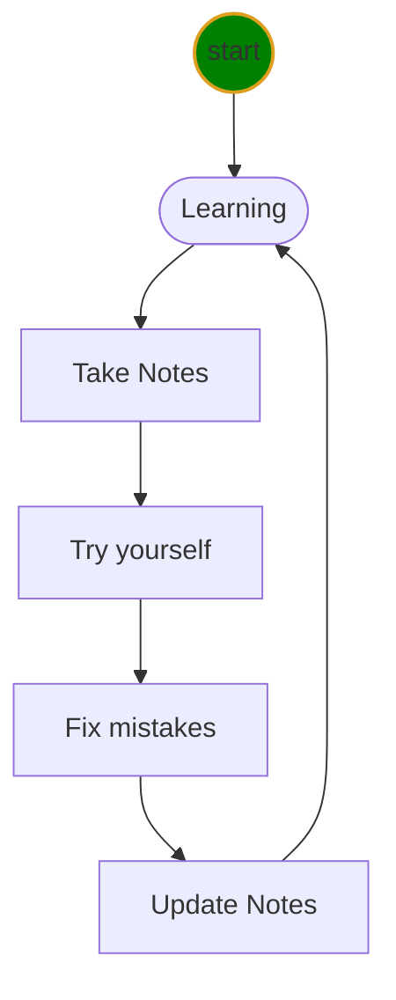

# Python class level-I Notes

* [Markdown Tricks](doc/markdownTricks.md)
* [VS Code Tricks](doc/vscodeTricks.md)
* [Python Programm](doc/python.md)
* [Software Installation](doc/installation.md)
* [Errors](doc/mistakes.md)
* [Icons](doc/myIcons.md)

## Learning Cycle
