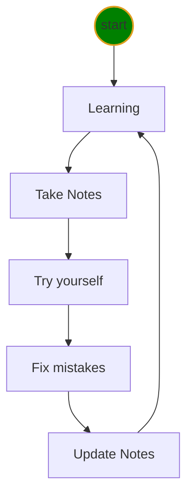

# Python class level-I Notes

1. [Markdown Tricks](doc/markdownTricks.md)
2. [Software Installation](doc/installation.md)
3. [Python Program](doc/python.md)
4. [VSCode Tricks](doc/vscodeTricks.md)
5. [Keyboard](doc/keyboard.md)
6. [Mistakes](doc/mistakes.md)
7. [Icons](doc/myIcons.md)
8. 👍[QA](doc/questionAnswer.md)

Repository
## Learning Cycle
