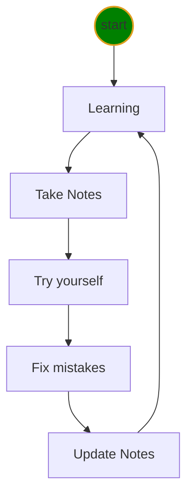

# Python class level-I Notes

1. 🔥[Python Program](doc/python.md)
2. [Markdown Tricks](doc/markdownTricks.md)
3. [Software Installation](doc/pythonInstall.md)
4. [VSCode Tricks](doc/vscodeTricks.md)
5. [Keyboard](doc/keyboard.md)
6. ❌[Mistakes](doc/mistakes.md)
7. [Icons](doc/myIcons.md)
8. ❓[✔️QA](doc/questionAnswer.md)

C:\Users\12818\AppData\Local\Programs\Python\Python39\python

<<<<<<< HEAD
## file structure 
=======
## file structure
>>>>>>> 4c9dae125ba5f1b1c223e77797bd18800f78a7a1
```output
<project root>
    ├── 📝doc/
    |    ├── mistakes.md 
    |    ├── vscodeTrics.md 
    |    └── python.md 
    ├── 🔨homeworks/
    |       └── <filenameXX.md>
    ├── 🔥src/
    |      └── hello.py 
    └── 👉ReadMe.md
```
## Learning Cycle


  


