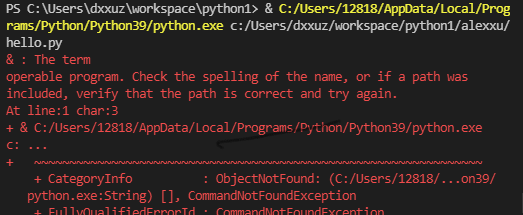

✔️❌❓ 

❌ & : The term 
'C:/Users/12818/AppData/Local/Programs/Python/Python39/python.exe' is   
not recognized as the name of a cmdlet, function, script file, or       
operable program. Check the spelling of the name, or if a path was      
included, verify that the path is correct and try again.
At line:1 char:3
+ & C:/Users/12818/AppData/Local/Programs/Python/Python39/python.exe    
c: ...
+   ~~~~~~~~~~~~~~~~~~~~~~~~~~~~~~~~~~~~~~~~~~~~~~~~~~~~~~~~~~~~~~~~    
    + CategoryInfo          : ObjectNotFound: (C:/Users/12818/...on39/  
   python.exe:String) [], CommandNotFoundException
    + FullyQualifiedErrorId : CommandNotFoundException

✔️specify python interpreter 
click select the python interpreter on the bottom > pick up python 3.9.5 64-bit

