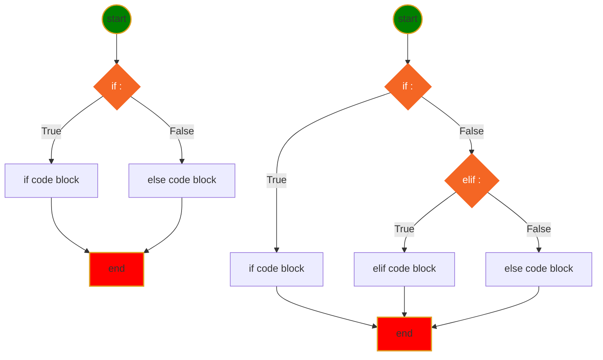

<h1>Python Language</h1>

[Markdown Shared Library](myIcons.md)

- [My First python program](#my-first-python-program)
- [print](#print)
- [comment](#comment)
- [Variable Naming](#variable-naming)
  - [Variable and memory](#variable-and-memory)
- [Data Type](#data-type)
- [operator](#operator)
- [Multiply time operator: **](../src/other.py)
- [Loop](../src/loop.py)

## My First python program
[hello world](../src/hello.py)

## print
[print](../src/print.py)
- place holder (%s, %d, %f)
- print with tuple
- formated print: print(f"x={x}") 

## comment 
[comment](../src/comment.py)
* single line comment: #
* multiple lines comment: """, '''

## Variable Naming
1. variable name cannot start with number
2. variable can be combination of letters and numbers _, a~z, A~Z, 0~9, no other special characters
3. don't use reserved keywords as variable name

[Python Keywords](https://realpython.com/python-keywords/#:~:text=%20Python%20Keywords%20and%20Their%20Usage%20%201,are%20used%20for%20control%20flow%3A%20if%2C...%20More%20)
4. Avoid using existing function name as your variable name.
otherwise, your python builtins functions no longer works the way you expected.
### Variable and memory

## Data Type
* [Numbers](../src/number.py)
    - int: a=4
    - float: a=3.4
    - complex: c=4-3j
* [String](../src/string.py)
    - string is iterable
    - string slicing: [[start]:[end]:[step]]
    - String operator +, *
    - as function str(object)
    - string functions
* [Tuple](../src/tuple.py)
    - tuple is iterable
    - tuple is immutable
    - tuple slicing: tuple1[[start]:[end]:[step]]
    - tupler operator +, *
    - as function: tuple(iterable)
    - tuple functions ()
* [List](../src/list.py)
    - list is iterable
    - list is mutable
    - list slicing: list1[[start]:[end]:[step]]
    - list operators +, *
    - modify list
    - as function: list(iterable)
    - list functions (append, insert)
* [Set](../src/set.py)
    - set is iterable
    - set is mutable
    - set operators: &, |, <, >, ==
    - modify set
    - as function: set(iterable)
    - set functions ()
* [Dictionary](../src/dictionary.py)
    - iterable
    - mutable
    - no duplication
    - ** operator
    - function (items, keys, values, clear, pop)

## operator
* Arithmatic operator: +;-;*;/;%;**;// floor divisor
    [Arithmatic.py](../src/arithmatic.py)
* Assignment Operators: =; +=; -=; *=; /=; %=; **=; //=
    [Assignment.py](../src/assignment.py)
* Comparison Operators: ==; !=; <; >; >=; <=
    

## Execution If else 

$$
\underbrace {def}_{keyword} \underbrace {circle \_area}_{function \space name} \left(\underbrace {a, b,c ...}_{positional\; args} * \underbrace {e=None, f=200}_{keyword\;args}\right) \underbrace {:}_{eol}
$$

[define inner functions inside outer function](../src/functioninfunction.py)
[return function](../src/returnFunction.py)
[pass function](../src/passFunction.py)

-single response, do the single thing

# oop (Object Oriented Programming)

* Abstraction
 

## loop
 

* 

* [for/while loop](../src/loop.py)

* while loop
    

