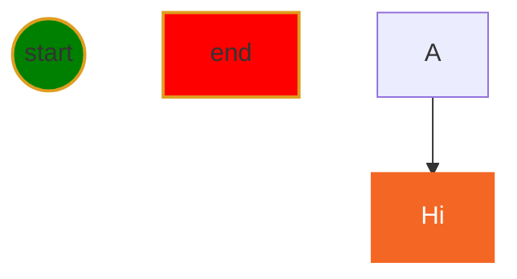
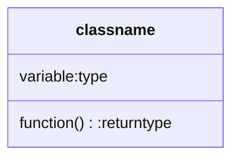

1. Add Extension (Markdown PDF, PDF Preview, Python)
2. Save file
3. Open Terminal
4. Add Terminal
5. Create a Python file
6. Run Python file
1. Create title
2. Create bulletin list
3. Display image
4. Display web link
5. Create DOS command block
6. Create python program block
7. Convert markdown to PDF
8. Create file link 

## Create shortcut for complex code block
right-click in Editor window ⟹ command palettes ⟹ Configure user snipittes ⟹ python.json

Rigth-click in editor window ⟹ command palettes ⟹ configure user snippets ⟹ markdown.json.

