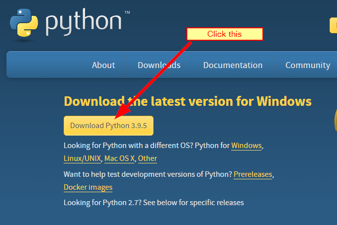

# Software Installation for Python class


## Install Python Interpretor
[Python Download Page](https://www.python.org/downloads/)



## Install VS Code

## Install Git

## Check Installation
* 😄check python
```DOS
python --version
```
* check vscode
  
    Desktop > double click Visual Studio Code icon

