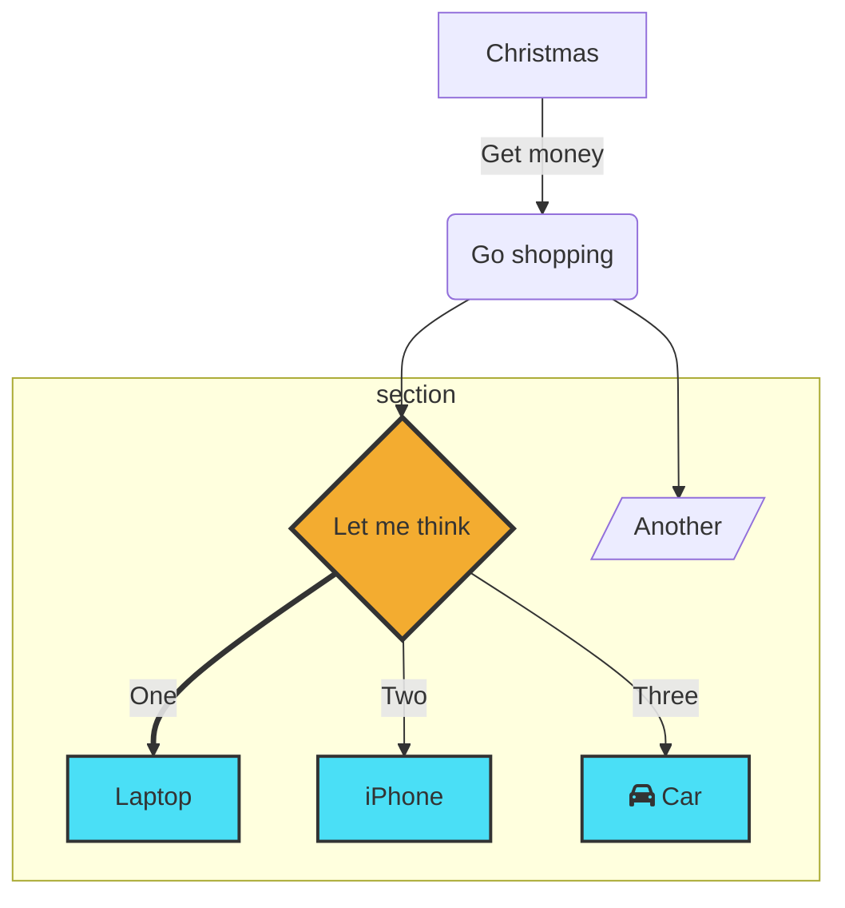

# Markdown Tricks
[Markdown Shared](myIcons.md)
[Markdown doc](https://www.markdownguide.org/cheat-sheet)

Thanks for visiting [The Markdown Guide](https://www.markdownguide.org)!

This Markdown cheat sheet provides a quick overview of all the Markdown syntax elements. It can’t cover every edge case, so if you need more information about any of these elements, refer to the reference guides for [basic syntax](https://www.markdownguide.org/basic-syntax) and [extended syntax](https://www.markdownguide.org/extended-syntax).

## Basic Syntax

These are the elements outlined in John Gruber’s original design document. All Markdown applications support these elements.

### Heading
```
# H1
## H2
### H3
```
### Bold

**bold text**

### Italic

*italicized text*

### Blockquote

> blockquote

### Ordered List

1. First item
2. Second item
3. Third item

### Unordered List

- First item
- Second item
- Third item

### Code

`code`

### Horizontal Rule

---

### Link

[title](https://www.example.com)

### Image


## Extended Syntax

These elements extend the basic syntax by adding additional features. Not all Markdown applications support these elements.

### Table

| Syntax    | Description |
| --------- | ----------- |
| Header    | Title       |
| Paragraph | Text        |

### Fenced Code Block

```json
{
  "firstName": "John",
  "lastName": "Smith",
  "age": 25
}
```

### Footnote

Here's a sentence with a footnote. [^1]

[^1]: This is the footnote.

### Heading ID

### My Great Heading {#custom-id}

### Definition List

term
: definition

### Strikethrough

~~The world is flat.~~

### Task List

- [x]Write the press release
- [ ] Update the website
- [ ] Contact the media

## Center Image

<center></center>

## Create Table of contents

Command Palette... > Markdown All in One: Create Table of Contents

## Markdown emotion icons
👍 [All icons](https://www.webfx.com/tools/emoji-cheat-sheet/) 这篇文章很棒，很容易使用。

:heavy_check_mark: ✔️正确
:x: ❌错误
:+1: 👍 赞美
:-1: 👎 鄙视
:smile: 😄 微笑
:cry: 😢 哭泣
:rose: 🌹玫瑰
:heart: ❤️心爱
:a: 🅰️字母
:ok: 🆗好
:ballot_box_with_check: ☑️正确
:white_check_mark: ✅
:arrow_right: ➡️右箭头
:arrow_forward: ▶️开始
:repeat: 🔁反复
:floppy_disk: 💾储存
:pushpin:📌图钉
:bulb: 💡顿悟
:memo: 📝记录
:warning: ⚠️警告
:fast_forward: ⏩快进
:rewind: ⏪回放
:copyright: ©️ 
:hammer: 🔨榔头
:butterfly: 🦋
:triangular_ruler:📐三角尺
:fire:🔥火焰
:email:✉️邮件
:recycle:♻️回收
:notebook:📓
:ledger:📒
:wastebasket:🗑
:question:❓
:bug:🐛
:phone:☎️
:phone-alt:☎
:exclamation:❗️
:point_up:☝️
:point_right:👉
:ok_hand:👌

⚡️📄📝✔️❌❓❗️📌🔨💡☝️👉👍👎👌💾🗑🐛📒⚠️😄😢♻️🔥🛠📐🎯✉️☎️

##  insert icon

 reduce the icon size.

##  mermaid diagram

[Mermaid Samples](mermaid.md)


