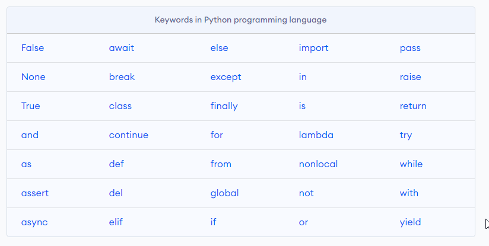
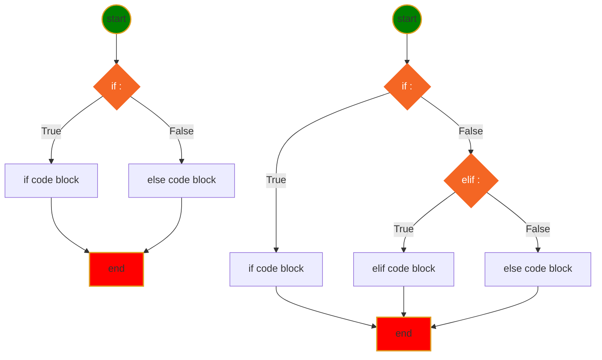

<h1> Python Language Basic </h1>

[Interesting Icons](myIcons.md)


- [My First python program](#my-first-python-program)
- [print(with variable)](#printwith-variable)
- [comment (single line, multiple line)](#comment-single-line-multiple-line)
- [Variable Naming](#variable-naming)
- [Data Type](#data-type)
- [Operator](#operator)
- [Execution Control](#execution-control)
- [Loop](#loop)


## My First python program
😄 I like this first simple python code.
```py
print("Hello, world!")
```

## print(with variable)

## comment (single line, multiple line)

## Variable Naming
1. variable name cannot start with number
2. variable can be combination of letters and numbers _, a~z, A~Z, 0~9, no other special characters
3. don't use reserved keywords as variable name

[Python Keywords](https://realpython.com/python-keywords/#:~:text=%20Python%20Keywords%20and%20Their%20Usage%20%201,are%20used%20for%20control%20flow%3A%20if%2C...%20More%20)
4. Avoid using existing function name as your variable name.
otherwise, your python builtins functions no longer works the way you expected.

## Data Type
* [Numbers](../src/number.py)
    - int
    - float
    - str
* [String](../src/string.py)
* [Tuple](../src/tuple.py)

## Operator 

## Execution Control
* **if-elif-else** statement Syntax
```py
if <condition>:
    # if code block here
elif <condition>:
    # elif code block here
else:
    #else code block here
# code continue ...
```
* Mermaid Diagram for if-else statement


## Loop
