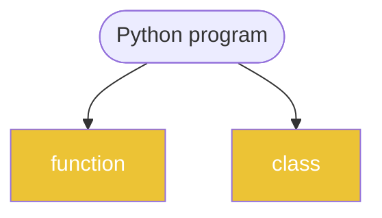
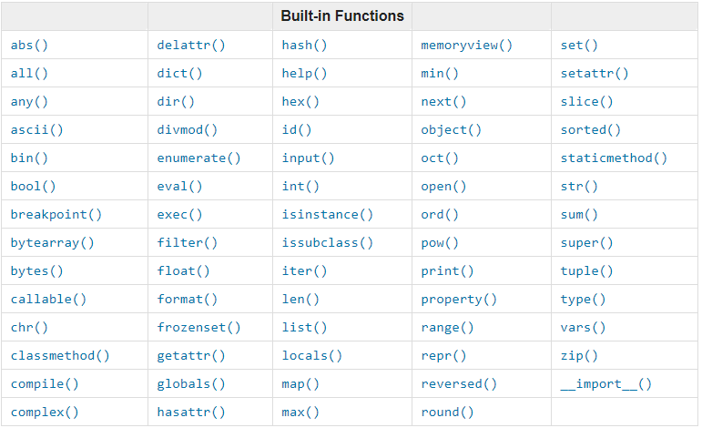

<h1>Python Language</h1>

[Markdown Shared Library](myIcons.md)

## Table of Contents
- [Table of Contents](#table-of-contents)
- [My First python program](#my-first-python-program)
- [print](#print)
- [comment](#comment)
- [Variable Naming](#variable-naming)
  - [Variable and memory](#variable-and-memory)
- [Data Type](#data-type)
- [operator](#operator)
- [Loop](#loop)
- [Function](#function)
- [OOP](#oop)
  - [abstraction](#abstraction)


## My First python program
[hello world](../src/hello.py)

## print
[print](../src/print.py)
- place holder (%s, %d, %f)
- print with tuple
- formated print: print(f"x={x}") 

## comment 
[comment](../src/comment.py)
* single line comment: #
* multiple lines comment: """, '''

## Variable Naming
1. variable name cannot start with number
2. variable can be combination of letters and numbers _, a~z, A~Z, 0~9, no other special characters
3. don't use reserved keywords as variable name


[Python Keywords](https://realpython.com/python-keywords/#:~:text=%20Python%20Keywords%20and%20Their%20Usage%20%201,are%20used%20for%20control%20flow%3A%20if%2C...%20More%20)
1. Avoid using existing function name as your variable name.
otherwise, your python builtins functions no longer works the way you expected.

---
[Table of Contents](#table-of-contents)

### Variable and memory


## Data Type
* [Numbers](../src/number.py)
    - int: a=4
    - float: a=3.4
    - complex: c=4-3j
* [String](../src/string.py)
    - string is iterable
    - string slicing: [[start]:[end]:[step]]
    - String operator +, *
    - as function str(object)
    - string functions
* [Tuple](../src/tuple.py)
    - tuple is iterable
    - tuple is immutable
    - tuple slicing: tuple1[[start]:[end]:[step]]
    - tupler operator +, *
    - as function: tuple(iterable)
    - tuple functions ()
* [List](../src/list.py)
    - list is iterable
    - list is mutable
    - list slicing: list1[[start]:[end]:[step]]
    - list operators +, *
    - modify list
    - as function: list(iterable)
    - list functions (append, insert)
* [Set](../src/set.py)
    - set is iterable
    - set is mutable
    - set operators: &, |, <, >, ==
    - modify set
    - as function: set(iterable)
    - set functions ()
* [Dictionary](../src/dictionary.py)
    - iterable
    - mutable
    - no duplication
    - ** operator
    - function (items, keys, values, clear, pop)

## operator
* Arithmatic Operator: +; -; *; /: %; **;//(floor divisor)
    [arithmatic.py](../src/arithmatic.py)
* Assignment Operators: =; +=; -=; *=; /=; %=; **=; //=
    [assignment.py](../src/assignment.py)
* Comparison Operators: ==, !=, <, >, <=, >=
    [comparison.py](../src/comparison.py)
* Logical Operator: and, or, not
    [logical.py](../src/logical.py)
* Membership Operator: in, not in
    [membership.py](../src/membership.py)
* Identity Operator: is, is not
    [identity.py](../src/identity.py)

## Loop
* [for/while loop](../src/loop.py)
    1. initial value: a = 0
    2. loop condition on the value: a<10
    3. adjust value: a += 1


## Function
* Python built in functions


* define a function
$$
\underbrace {def}_{keyword} \underbrace {circle \_area}_{function \space name} \left(\underbrace {a, b,c ...}_{positional\; args} * \underbrace {e=None, f=200}_{keyword\;args}\right) \underbrace {:}_{eol}
$$
    - def, Python reserved keyword
    - function name, anything you want, but need follow the naming rules
    - (), must have open/close parenthesis pair, no matter it has arguments or not
    - arguments, positional or keyword arguments separated by comma ,
    - :, must end with colon
    - the function body must indent
    - ❗️⚡️function can be overridden
    - 😄a function can return more than one values
    - 💡it is better the function only take single responsibility
    - call a function by function name and (), and arguments if there is any

* [define circleArea and sayHello function](../src/function.py)
* [def circleArea function only](../src/circle.py)
* [Understand if __name__=='__main__':](../src/testCircle.py)
```py
if __name__ == '__main__':
    # your test code go here
```
give developer a chance to write test code before it used somewhere else.
* [handle negative radius by raise Error](../src/tryexcept.py)
* [define inner functions](../src/functionInFunction.py)
* [define a function return a function](../src/returnFunction.py)
* [define a function as a goal has another function as a argument](../src/passFunction.py)

---
[Table of Contents](#table-of-contents)

## OOP


### abstraction


* [class definition, define simple class](../src/class01.py)
* [outside function help robot introduce himself](../src/class02.py)
* [robot itself introduce himself](../src/class03.py)
* [add constructor and create name on object build time](../src/class04.py)
* [define __repr__()](../src/class05.py)
* [compare __repr__() and __str__()](../src/class06.py)
* [make our object attribute private]()
* 