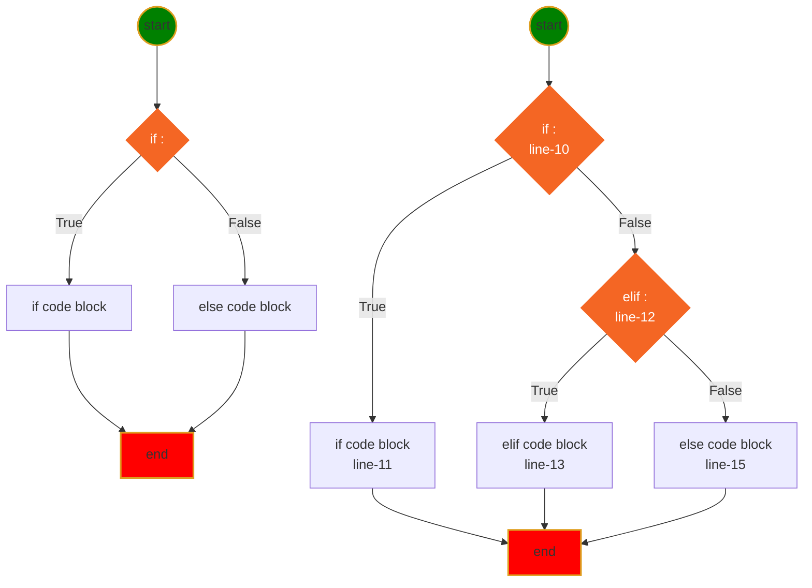
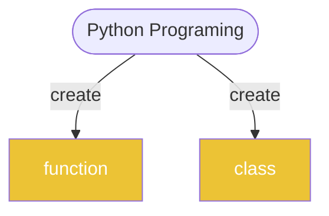

<h1>Python Language</h1>

[Markdown Shared Library](myIcons.md)

## Table of Contents
- [Table of Contents](#table-of-contents)
- [My First python program](#my-first-python-program)
- [print](#print)
- [comment](#comment)
- [Variable Naming](#variable-naming)
  - [Variable and memory](#variable-and-memory)
- [Data Type](#data-type)
- [operator](#operator)
- [Execution Control (If-else)](#execution-control-if-else)
- [Loop](#loop)
- [Function](#function)
- [OOP (Object Oriented Programming)](#oop-object-oriented-programming)

## My First python program
[hello world](../src/hello.py)

## print
[print](../src/print.py)
- place holder (%s, %d, %f)
- print with tuple
- formated print: print(f"x={x}") 

## comment 
[comment](../src/comment.py)
* single line comment: #
* multiple lines comment: """, '''

---
[Table of Contents](#table-of-contents)

## Variable Naming
1. variable name cannot start with number
2. variable can be combination of letters and numbers _, a~z, A~Z, 0~9, no other special characters
3. don't use reserved keywords as variable name
   


[Python Keywords](https://realpython.com/python-keywords/#:~:text=%20Python%20Keywords%20and%20Their%20Usage%20%201,are%20used%20for%20control%20flow%3A%20if%2C...%20More%20)

4. Avoid using existing function name as your variable name.
otherwise, your python builtins functions no longer works the way you expected.
### Variable and memory


---
[Table of Contents](#table-of-contents)

## Data Type
* [Numbers](../src/number.py)
    - int: a=4
    - float: a=3.4
    - complex: c=4-3j
* [String](../src/string.py)
    - string is iterable
    - string slicing: [[start]:[end]:[step]]
    - String operator +, *
    - as function str(object)
    - string functions
* [Tuple](../src/tuple.py)
    - tuple is iterable
    - tuple is immutable
    - tuple slicing: tuple1[[start]:[end]:[step]]
    - tupler operator +, *
    - as function: tuple(iterable)
    - tuple functions ()
* [List](../src/list.py)
    - list is iterable
    - list is mutable
    - list slicing: list1[[start]:[end]:[step]]
    - list operators +, *
    - modify list
    - as function: list(iterable)
    - list functions (append, insert)
* [Set](../src/set.py)
    - set is iterable
    - set is mutable
    - set operators: &, |, <, >, ==
    - modify set
    - as function: set(iterable)
    - set functions ()
* [Dictionary](../src/dictionary.py)
    - iterable
    - mutable
    - no duplication
    - ** operator
    - function (items, keys, values, clear, pop)


## operator
* Arithmatic Operator: +; -; *; /: %; **;//(floor divisor)
    [arithmatic.py](../src/arithmatic.py)
* Assignment Operators: =; +=; -=; *=; /=; %=; **=; //=
    [assignment.py](../src/assignment.py)
* Comparison Operators: ==, !=, <, >, <=, >=
    [comparison.py](../src/comparison.py)
* Logical Operator: and, or, not
    [logical.py](../src/logical.py)
* Membership Operator: in, not in
    [membership.py](../src/membership.py)
* Identity Operator: is, is not
    [identity.py](../src/identity.py)
* Ternary operator: if-else, and-or
    [ternary.py](../src/ternary.py)
* Multiple times operator: **
    [others.py](../src/others.py)
* Bitwise Operator: &, |, ^, <<, >>
    [bitwise.py](../src/bitwise.py)

## Execution Control (If-else)
Execution control



* [If without else](../src/if-else01.py)
* [if with elif and else](../src/if-else02.py)


## Loop
* For loop
  

* [for/while loop](../src/loop.py)

* While loop
    
* Python does NOT support do-while loop, but you can simulate do-while.
    
```
while loop has 3 part:
1. initialize variable, a=0
2. variable condition, a<10
3. adjust variable, a +=1
```



---
[Table of Contents](#table-of-contents)

## Function
A function is a block of organized, reusable code 
that is used to perform a single, related action.

    - def: use Python reserved keyword
    - function name: you can name a function whatever you want but follow the variable rules.
    - () you have to include () pair in you function definition
    - : must end your definition with :.
    - the function body must indent
    - ❗️⚡️function can be overridden
    - 😄return more than one value
    - 💡Single response, do single thing
    - call a function by function name and (), and arguments if thers is any

$$
\underbrace {def}_{keyword} \underbrace {circle \_area}_{function \space name} \left(\underbrace {a, b,c ...}_{positional\; args} * \underbrace {e=None, f=200}_{keyword\;args}\right) \underbrace {:}_{eol}
$$

* [function.py](../src/function.py)
* [argument.py](../src/argument.py)
* [raise error when radius<0](../src/circle.py)
* [understand if __name__ == '__main__':](../src/testCircle.py)
>😄avoid running test code from outside
* [add try-except block](../src/tryexcept.py)
* [Define inner functions inside outer function](../src/functionInFunction.py)
* [return function dynamically](../src/returnFunction.py)
>part of Functional programming which focus on goal
* [Functional programming basic](../src/passFunction.py)

## OOP (Object Oriented Programming)

* Abstraction
  
* [Simplest class](../src/class01.py)
* [say Hello outside of the class](../src/class02.py)
* [Robot now can introduce himself](../src/class03.py)
* [Define constructor: __init__() with initial name](../src/class04.py)
* [make the inputName as keyword argument](../src/class05.py)