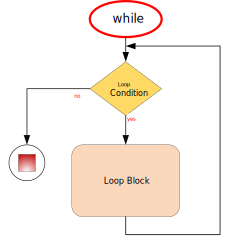
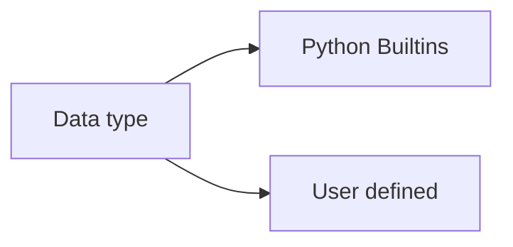

<h1>Python Language</h1>

[Markdown Shared Library](myIcons.md)

## Table of Contents
- [Table of Contents](#table-of-contents)
- [My First python program](#my-first-python-program)
- [print](#print)
- [comment](#comment)
- [Variable Naming](#variable-naming)
  - [Variable and memory](#variable-and-memory)
- [Data Type](#data-type)
- [operator](#operator)
- [Execution Control (If-else)](#execution-control-if-else)
- [Loop](#loop)
- [Function](#function)
- [OOP (Object Oriented Programming) and class](#oop-object-oriented-programming-and-class)
  - [class basic](#class-basic)
  - [attribute scope](#attribute-scope)
  - [dunder functions](#dunder-functions)
  - [class tricks](#class-tricks)
  - [class inheritance](#class-inheritance)
- [Blackjack Card Game](#blackjack-card-game)

## My First python program
[hello world](../src/hello.py)

## print
[print](../src/print.py)
- place holder (%s, %d, %f)
- print with tuple
- formated print: print(f"x={x}") 

## comment 
[comment](../src/comment.py)
* single line comment: #
* multiple lines comment: """, '''

---
[Table of Contents](#table-of-contents)

## Variable Naming
1. variable name cannot start with number
2. variable can be combination of letters and numbers _, a~z, A~Z, 0~9, ❗️⚡️no other special characters
3. don't use reserved keywords as variable name
   


[Python Keywords](https://realpython.com/python-keywords/#:~:text=%20Python%20Keywords%20and%20Their%20Usage%20%201,are%20used%20for%20control%20flow%3A%20if%2C...%20More%20)

4. Avoid using existing function name as your variable name.
otherwise, your python builtins functions no longer works the way you expected.

5. ☝️class name, function name and attribute name, all of them must follow the rules above☝️.
   
### Variable and memory


---
[Table of Contents](#table-of-contents)

## Data Type
* [Numbers](../src/number.py)
    - int: a=4
    - float: a=3.4
    - complex: c=4-3j
* [String](../src/string.py)
    - string is iterable
    - string slicing: [[start]:[end]:[step]]
    - String operator +, *
    - as function str(object)
    - string functions
* [Tuple](../src/tuple.py)
    - tuple is iterable
    - tuple is immutable
    - tuple slicing: tuple1[[start]:[end]:[step]]
    - tupler operator +, *
    - as function: tuple(iterable)
    - tuple functions ()
* [List](../src/list.py)
    - list is iterable
    - list is mutable
    - list slicing: list1[[start]:[end]:[step]]
    - list operators +, *
    - modify list
    - as function: list(iterable)
    - list functions (append, insert)
* [Set](../src/set.py)
    - set is iterable
    - set is mutable
    - set operators: &, |, <, >, ==
    - modify set
    - as function: set(iterable)
    - set functions ()
* [Dictionary](../src/dictionary.py)
    - iterable
    - mutable
    - no duplication
    - ** operator
    - function (items, keys, values, clear, pop)


## operator
* Arithmatic Operator: +; -; *; /: %; **;//(floor divisor)
    [arithmatic.py](../src/arithmatic.py)
* Assignment Operators: =; +=; -=; *=; /=; %=; **=; //=
    [assignment.py](../src/assignment.py)
* Comparison Operators: ==, !=, <, >, <=, >=
    [comparison.py](../src/comparison.py)
* Logical Operator: and, or, not
    [logical.py](../src/logical.py)
* Membership Operator: in, not in
    [membership.py](../src/membership.py)
* Identity Operator: is, is not
    [identity.py](../src/identity.py)
* Ternary operator: if-else, and-or
    [ternary.py](../src/ternary.py)
* Multiple times operator: **
    [others.py](../src/others.py)
* Bitwise Operator: &, |, ^, <<, >>
    [bitwise.py](../src/bitwise.py)

## Execution Control (If-else)
Execution control


* [If without else](../src/if-else01.py)
* [if with elif and else](../src/if-else02.py)


## Loop
* For loop
  

* [for/while loop](../src/loop.py)

* While loop
    
* Python does NOT support do-while loop, but you can simulate do-while.
    
```
while loop has 3 part:
1. initialize variable, a=0
2. variable condition, a<10
3. adjust variable, a +=1
```


---
[Table of Contents](#table-of-contents)

## Function
A function is a block of organized, reusable code 
that is used to perform a single, related action.

    - def: use Python reserved keyword
    - function name: you can name a function whatever you want but follow the variable rules.
    - () you have to include () pair in you function definition
    - : must end your definition with :.
    - the function body must indent
    - ❗️⚡️function can be overridden
    - 😄return more than one value
    - 💡Single response, do single thing
    - call a function by function name and () no matter it has arguments or not, and arguments if there is any

$$
\underbrace {def}_{keyword} \underbrace {circle \_area}_{function \space name} \left(\underbrace {a, b,c ...}_{positional\; args} * \underbrace {e=None, f=200}_{keyword\;args}\right) \underbrace {:}_{eol}
$$

* [function.py](../src/function.py)
* [argument.py](../src/argument.py)
* [raise error when radius<0](../src/circle.py)
* [understand if __name__ == '__main__':](../src/testCircle.py)
>😄avoid running test code block from import
* [add try-except block](../src/tryexcept.py)
* [Define inner functions inside outer function](../src/functionInFunction.py)
* [return function dynamically](../src/returnFunction.py)
>part of Functional programming which focus on goal
* [Functional programming basic](../src/passFunction.py)

## OOP (Object Oriented Programming) and class


❓What is class?
>Classes provide a means of bundling data and functionality together. Creating a new class creates a new type of object, allowing new instances of that type to be made. Each class instance can have attributes attached to it for maintaining its state. Class instances can also have methods (defined by its class) for modifying its state, or do some special thing.



There are 4 features in OOP
1. Abstraction: create class which abstract from the object in the real world.
2. Inheritance:  a class can inherit from multiple other classes to increase code reuseability.
3. Encapsulation: avoid data or function to be accessed outside unintentionally.
4. Polymorphism: same function behavior differently by different object type which inherit from same class.

* Abstraction
  

### class basic
* [Simplest class](../src/class01.py)
* [say Hello outside of the class](../src/class02.py)
* [Robot now can introduce himself](../src/class03.py)
* [Define constructor: __init__() with initial name](../src/class04.py)
* [make the inputName as keyword argument](../src/class05.py)
* [make private attribute __energy](../src/class07.py)
* [build getter, setter, and property](../src/class08.py)

### attribute scope
* [class level attribute vs. instance level attribute](../src/class11.py)
* [Solve the class level attribute issue](../src/class12.py)

### dunder functions
* [compare __repr__() most time, and __str__()](../src/class06.py)
  - __repr__() function can only return str type, or need to convert it to str.
* [play __new__() with __init__() is used to initialize object](../src/class09.py)
* [return instance from other class (override __new__())](../src/class10.py)
* [override __iter__, __next__ function](../src/class15.py)
* [start from 1 include stop, override __iter__, __next__](../src/range1.py)

### class tricks
* [define class function outside, use function in different class](../src/class13.py)
* [internal function call another internal function](../src/class14.py)
* [class level function and attributes](../src/class18.py)

### class inheritance
❓What inherit means?
✔️to be born with the same physical or mental characteristics as one of your parents or grandparents:
Definition of Inheritance in Software world: A subclass inherits all of the features including attributes and functions from superclass.
❓How do I inherit from a superclass?
✔️👇see following code below
```py
class Subclass(Superclass):
    pass
```


* [Person is a super class](../src/person.py)
* [Student is a person](../src/student.py)
* [Engineer is a person]((../src))

❓How do I initialize instance level attribute?
✔️1. initialize the intstance level attribute on __init__(); 2. define instance level attribute in setter.

* [class inheritance](../src/class16.py)
1. If subclass define its own __init__(), the superclass __init__() no longer works
2. subclass can override superclass functions.

* [](../src/class17.py)
## Blackjack Card Game
* [Blackjack Rules](https://bicyclecards.com/how-to-play/blackjack/)
