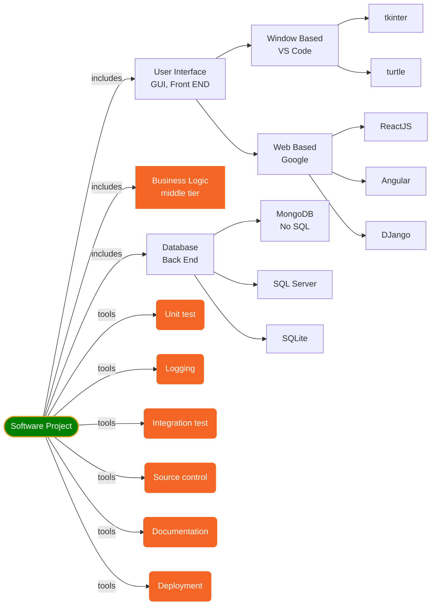
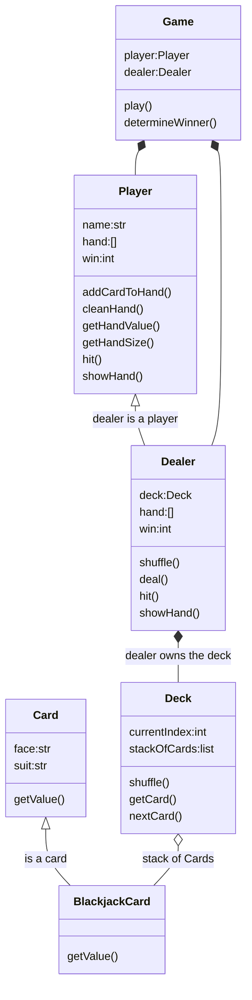
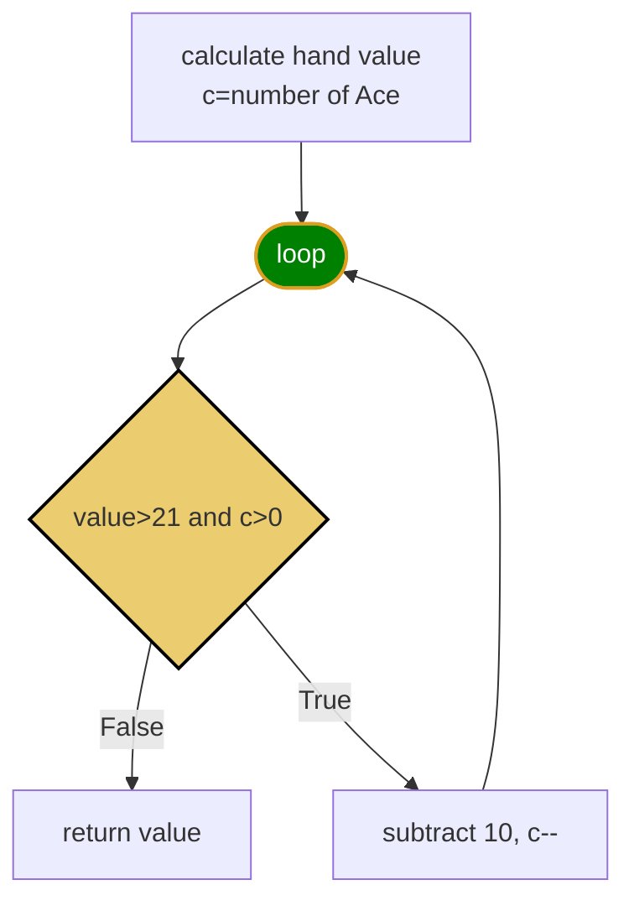
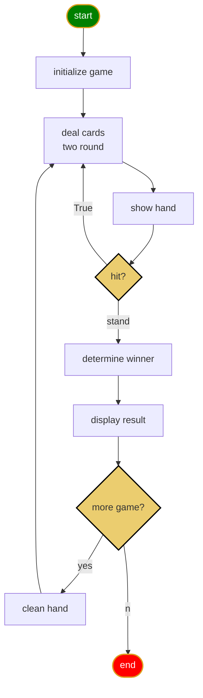
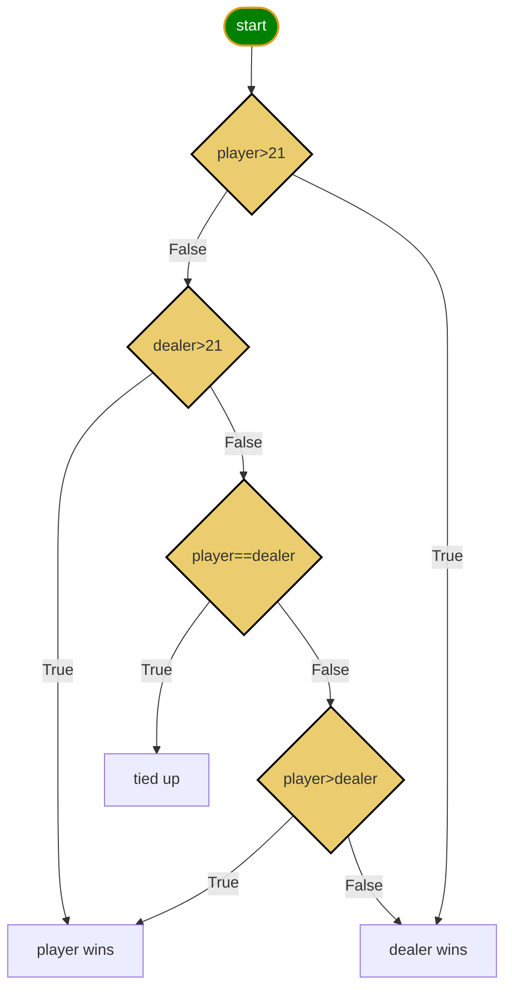

<h1>Python Language</h1>

[Markdown Shared Library](myIcons.md)

## Table of Contents
- [Table of Contents](#table-of-contents)
- [My First python program](#my-first-python-program)
- [Getting Start](#getting-start)
- [print](#print)
- [comment](#comment)
- [Variable Naming](#variable-naming)
  - [Variable and memory](#variable-and-memory)
- [Data Type](#data-type)
- [operator](#operator)
- [Execution Control (If-else)](#execution-control-if-else)
- [Loop](#loop)
- [Function](#function)
- [OOP (Object Oriented Programming) and class](#oop-object-oriented-programming-and-class)
  - [class basic](#class-basic)
  - [attribute scope](#attribute-scope)
  - [dunder functions](#dunder-functions)
  - [class tricks](#class-tricks)
  - [class inheritance](#class-inheritance)
- [Software Development](#software-development)
- [Unit Test](#unit-test)
- [Logging](#logging)
- [Blackjack Card Game](#blackjack-card-game)
  - [Blackjack Rules](#blackjack-rules)
  - [getHandValue()](#gethandvalue)
  - [Game Play Logic](#game-play-logic)
  - [missing unit tests](#missing-unit-tests)
  - [use logging in Blackjack](#use-logging-in-blackjack)
- [Documentation](#documentation)
  - [document for developer](#document-for-developer)
  - [Document for player (user)](#document-for-player-user)
- [Data Structure](#data-structure)
  - [stack](#stack)
- [Deployment](#deployment)
- [tkinter](#tkinter)
  - [Open window](#open-window)
  - [use widgets](#use-widgets)
  - [display image](#display-image)

## My First python program
[hello world](../src/hello.py)

## Getting Start
❓ How do I run python program?
✔️

❓ How do I save python file?
✔️

❓ How do I open new Terminal?
✔️

❓ How do I open Python playground?
✔️

❓ How do I find all Python built-in functions?
✔️

❓ How do I find all Python built-in fuction documents?
✔️


## print
[print](../src/print.py)
- place holder (%s, %d, %f)
- print with tuple
- formated print: print(f"x={x}") 

## comment 
[comment](../src/comment.py)
* single line comment: #
* multiple lines comment: """, '''

---
[Table of Contents](#table-of-contents)

## Variable Naming
1. variable name cannot start with number
2. variable can be combination of letters and numbers _, a~z, A~Z, 0~9, ❗️⚡️no other special characters
3. don't use reserved keywords as variable name
   


[Python Keywords](https://realpython.com/python-keywords/#:~:text=%20Python%20Keywords%20and%20Their%20Usage%20%201,are%20used%20for%20control%20flow%3A%20if%2C...%20More%20)

4. Avoid using existing function name as your variable name.
otherwise, your python builtins functions no longer works the way you expected.

5. ☝️class name, function name and attribute name, all of them must follow the rules above☝️.
   
### Variable and memory


---
[Table of Contents](#table-of-contents)

## Data Type
* [Numbers](../src/number.py)
    - int: a=4
    - float: a=3.4
    - complex: c=4-3j
* [String](../src/string1.py)
    - string is iterable
    - string slicing: [[start]:[end]:[step]]
    - String operator +, *
    - as function str(object)
    - string functions
* [Tuple](../src/tuple.py)
    - tuple is iterable
    - tuple is immutable
    - tuple slicing: tuple1[[start]:[end]:[step]]
    - tupler operator +, *
    - as function: tuple(iterable)
    - tuple functions ()
* [List](../src/list.py)
    - list is iterable
    - list is mutable
    - list slicing: list1[[start]:[end]:[step]]
    - list operators +, *
    - modify list
    - as function: list(iterable)
    - list functions (append, insert)
* [Set](../src/set.py)
    - set is iterable
    - set is mutable
    - set operators: &, |, <, >, ==
    - modify set
    - as function: set(iterable)
    - set functions ()
* [Dictionary](../src/dictionary.py)
    - iterable
    - mutable
    - no duplication
    - ** operator
    - function (items, keys, values, clear, pop)


## operator
* Arithmatic Operator: +; -; *; /: %; **;//(floor divisor)
    [arithmatic.py](../src/arithmatic.py)
* Assignment Operators: =; +=; -=; *=; /=; %=; **=; //=
    [assignment.py](../src/assignment.py)
* Comparison Operators: ==, !=, <, >, <=, >=
    [comparison.py](../src/comparison.py)
* Logical Operator: and, or, not
    [logical.py](../src/logical.py)
* Membership Operator: in, not in
    [membership.py](../src/membership.py)
* Identity Operator: is, is not
    [identity.py](../src/identity.py)
* Ternary operator: if-else, and-or
    [ternary.py](../src/ternary.py)
* Multiple times operator: **
    [others.py](../src/others.py)
* Bitwise Operator: &, |, ^, <<, >>
    [bitwise.py](../src/bitwise.py)

## Execution Control (If-else)
Execution control


* [If without else](../src/if-else01.py)
* [if with elif and else](../src/if-else02.py)


## Loop
* For loop
  

* [for/while loop](../src/loop.py)

* While loop
    
* Python does NOT support do-while loop, but you can simulate do-while.
    
```
while loop has 3 part:
1. initialize variable, a=0
2. variable condition, a<10
3. adjust variable, a +=1
```


---
[Table of Contents](#table-of-contents)

## Function
❓ What is function?
>✔️A function is a block of organized, reusable code 
that is used to perform a single, related action.

    - def: use Python reserved keyword
    - function name: you can name a function whatever you want but follow the variable rules.
    - () you have to include () pair in you function definition
    - : must end your definition with :.
    - the function body must indent
    - ❗️⚡️function can be overridden
    - 😄return more than one value
    - 💡Single response, do single thing
    - ❗️❗️call a function by function name and () no matter it has arguments or not, and arguments if thers is any

$$\underbrace {def}_{keyword} \underbrace {circle \_area}_{function \space name} \left(\underbrace {a, b,c ...}_{positional\; args} * \underbrace {e=None, f=200}_{keyword\;args}\right) \underbrace {:}_{eol}$$

* [function.py](../src/function.py)
* [argument.py](../src/argument.py)
* [raise error when radius<0](../src/circle.py)
* [understand if __name__ == '__main__':](../src/testCircle.py)
>😄avoid running test code block from import
* [add try-except block](../src/tryexcept.py)
* [Define inner functions inside outer function](../src/functionInFunction.py)
* [return function dynamically](../src/returnFunction.py)
>part of Functional programming which focus on goal
* [Functional programming basic](../src/passFunction.py)

## OOP (Object Oriented Programming) and class


❓What is class?
>Classes provide a means of bundling data and functionality together. Creating a new class creates a new type of object, allowing new instances of that type to be made. Each class instance can have attributes attached to it for maintaining its state. Class instances can also have methods (defined by its class) for modifying its state, or do some special thing.


There are 4 features in OOP
1. Abstraction: create class which abstract from the object in the real world.
2. Inheritance:  a class can inherit from multiple other classes to increase code reuseability.
3. Encapsulation: avoid data or function to be accessed outside unintentionally.
4. Polymorphism: same function behavior differently by different object type which inherit from same class.

* Abstraction
  

### class basic
* [Simplest class](../src/class01.py)
* [say Hello outside of the class](../src/class02.py)
* [Robot now can introduce himself](../src/class03.py)
* [Define constructor: __init__() with initial name](../src/class04.py)
* [make the inputName as keyword argument](../src/class05.py)
* [make private attribute __energy](../src/class07.py)
* [build getter, setter, and property](../src/class08.py)

### attribute scope
* [class level attribute vs. instance level attribute](../src/class11.py)
* [Solve the class level attribute issue](../src/class12.py)

### dunder functions
* [compare __repr__() most time, and __str__()](../src/class06.py)
  - __repr__() function can only return str type, or need to convert it to str.
* [play __new__() with __init__() is used to initialize object](../src/class09.py)
* [return instance from other class (override __new__())](../src/class10.py)
* [override __iter__, __next__ function](../src/class15.py)
* [start from 1 include stop, override __iter__, __next__](../src/range1.py)
* [class Card, override __add__, __gt__, __lt__, __eq__](../src/class24.py)

### class tricks
* [define class function outside, use function in different class](../src/class13.py)
* [internal function call another internal function](../src/class14.py)
* [class level function and attributes](../src/class18.py)
* [inherit from Enum, callable](../src/class17.py)
* [multiple inheritance](../src/class19.py)
* [Nested class](../src/class20.py)
* [Car has Engine](../src/class21.py)
* 
### class inheritance
❓What inherit means?
✔️to be born with the same physical or mental characteristics as one of your parents or grandparents:
Definition of Inheritance in Software world: A subclass inherits all of the features including attributes and functions from superclass.
❓How do I inherit from a superclass?
✔️👇see following code below
```py
class Subclass(Superclass):
    pass
```


* [Person is a super class](../src/person.py)
* [Student is a person](../src/student.py)
* [Engineer is a person](../src/engineer.py)

❓How do I initialize instance level attribute?
✔️1. initialize the instance level attribute in __init__(); 2. define instance level attribute in setter.

* [class inheritance](../src/class16.py)
1. If subclass define its own __init__(), the superclass __init__() no longer works
2. subclass can override superclass functions.


* [class inheritance](../src/class16.py)
1. If subclass define its own __init__(), the superclass __init__() no longer works
2. subclass can override superclass functions.
❓What is enumeration?
>✔️Enum is a class in python for creating enumerations, which are a set of symbolic names (members) bound to unique, constant values. 
* [class inheritance](../src/class16.py)
1. If subclass define its own __init__(), the superclass __init__() no longer works

## Software Development

* Software development must include the following parts at lease.

❓How do I adjust a good software?
✔️👍Performance!!!👍1. correct; 2. fast.

## Unit Test
❓What is unit test?
>✔️A unit is a specific piece of code need to be tested, such as a function or a class.  in our sample code, circleArea() function is a code unit. The Unit test are then other piece of code that specifically exercise the code unit with a **full range** of different inputs.

❓How do I configure the unit test in Python?
✔️Right-click ⟹ Command Palette... ⟹ Configure Tests ⟹ unittest ⟹ test ⟹ test_*.py

❓How do I run unittest?
✔️

[Test Circle area calculation](../test/test_circleArea.py)

## Logging
❓What is logging?
✔️write software execution record to console, file or database used for application analysis.
there are at least 5 level of logging: Debug, Info, Warning, Error, Fatal

[Out put log message to a file](../src/logging1.py)


## Blackjack Card Game
* [Blackjack Rules](https://bicyclecards.com/how-to-play/blackjack/)
### Blackjack Rules
1. Object of the game: 
>beat the dealer by getting a count as close to 21 as possible, without going over 21
2. Card Values 
>ace is worth 1 or 11, J,Q,K are 10, other card is its pip value
3. Betting
>for simplicity, we don't bet.
4. Shuffle and cut
>the dealer shuffles the pack of card, no need player cut
5. Deal
>dealer gives one card face up to each player, and one card face up for himself. Another round of cards is then dealt face up to each player, but the dealer takes the second card face down.
6. Naturals
>If a player's first two cards are an ace and a "ten-card" (a picture card or 10), giving a count of 21 in two cards, this is a natural or "blackjack." If any player has a natural and the dealer does not, the dealer loses.  If the dealer has a natural, other doesn't, dealer win. If both dealer and player have natural, nobody wins.
7. The Play
>any player on his turn must decide whether to "stand" (not ask for another card) or "hit" (ask for another card in an attempt to get closer to a count of 21, or even hit 21 exactly). Thus, a player may stand on the two cards originally dealt to them, or they may ask the dealer for additional cards, one at a time, until deciding to stand on the total (if it is 21 or under), or goes "bust" (if it is over 21). In the latter case, play loses the game. The dealer then turns to the next player and serves them in the same manner. The combination of an ace with a card other than a ten-card is known as a "soft hand," because the player can count the ace as a 1 or 11, and either draw cards or not. For example with a "soft 17" (an ace and a 6), the total is 7 or 17. While a count of 17 is a good hand, the player may wish to draw for a higher total. If the draw creates a bust hand by counting the ace as an 11, the player simply counts the ace as a 1 and continues playing by standing or "hitting" (asking the dealer for additional cards, one at a time).
8. The Dealer's Play
>When the dealer has served every player, the dealers face-down card is turned up. If the total is 17 or more, it must stand. If the total is 16 or under, they must take a card. The dealer must continue to take cards until the total is 17 or more, at which point the dealer must stand. If the dealer has an ace, and counting it as 11 would bring the total to 17 or more (but not over 21), the dealer must count the ace as 11 and stand. The dealer's decisions, then, are automatic on all plays, whereas the player always has the option of taking one or more cards.
9. No Splitting Pairs
10. No Doubing Down
11. No Insurance
12. Reshuffling when start new game.



[blackjack card game](../src/blackjack.py)
* Card
* BlackjackCard
* Deck
* Player
* Dealer
* Game

[Unit test](../test/test_blackjack.py)

### getHandValue()


❌👇Wrong code below, only handle 1 Ace!😢
```py
    def getHandValue(self):
        value = 0
        for card in self.hand:
            value += card.getValue()
        if value > 21 and self.hasAce(): # A=11,
            value -= 10 # change A=1
        return value

    def hasAce(self):
        for card in self.hand:
            if card.face == 'A':
                return True
        return False # return False till check every card in hand

```
✔️👇Better solution, handle 1,2,3,4 Aces in one player hand.😄
```py
  def getHandValue(self):
    value = 0
    for card in self.hand:
        value += card.getValue()
    a = self.numberAce()
    while value > 21 and a>0: # A=11,
        value -= 10 # change A=1
        a -= 1
    return value

  def numberAce(self):
    count = 0; 
    for card in self.hand:
        if card.face == 'A':
            count += 1
    return count # return number of Ace in hand

```
### Game Play Logic



* determine winner


### missing unit tests
1. player holds 1 Ace busted
2. player holds 1 Ace without busted
3. player holds 2 Aces
4. player holds 3 Aces
5. player holds 4 Aces (may never happens in integration test)

### use logging in Blackjack
1. copy logger code from logging1.py under Game class
```py
import logging

    LOG_FORMAT = "%(asctime)s %(levelname)8s - %(message)s"
    logging.basicConfig(filename=r"/Users/12818/workspace/python1/blackjack.log", level=logging.DEBUG, format=LOG_FORMAT)

    logger = logging.getLogger("Huaxia")
```
2. we add logger.debug() or logger.info() in our function.
3. change level on demands
```py
    logging.basicConfig(filename=r"/Users/12818/workspace/python1/blackjack.log", level=logging.INFO, format=LOG_FORMAT)
```

## Documentation
### document for developer
❓How do I open the python document for my blackjack game?
✔️Open Python playground ⟹ import src.blackjack as bj ⟹ help(bj)

❓How do I open Python playground?
✔️open a new terminal, type in python
```output
(env) C:\Users\12818\workspace\python1>python
Python 3.9.1 (tags/v3.9.1:1e5d33e, Dec  7 2020, 17:08:21) [MSC v.1927 64 bit (AMD64)] on win32
Type "help", "copyright", "credits" or "license" for more information.
>>>
```

❓How do I see document of function or class in blackjack module?
1. class
✔️Open Python playground ⟹ from src.blackjack import * ⟹ help(Card)
2. function
✔️Open Python playground ⟹ from src.blackjack import * ⟹ help(winner)
3. function in class
✔️Open Python playground ⟹ from src.blackjack import * ⟹ help(Game.play) 

### Document for player (user)
[Blackjack.md](blackjack.md)

## Data Structure
### stack
❓What is stack?
✔️a stack is an abstract data type that serves as a collection of elements, with two main principal operations: (LIFO) last in first out.
1. Push, which adds an element to the collection, and
2. Pop, which removes the most recently added element that was not yet removed.
you have list of element, stack each other.
* [stack.py](../src/stack.py)

## Deployment
1. open github > create new repository called "blackjack"
2. run the following command
```DOS
git clone https://github.com/jwang1122/blackjack.git
```
3. copy python files to the blackjack folder
4. push your source code to gitHub

## tkinter
❓ What is tkinter?
✔️ It is a framework provides Python developer with a simple way to create Window-based GUI elements using
Widgets found in the TK toolkit. TK widgets can be used to constructor buttons, menus, text field, label,... 
in python application.

### Open window
* [open empty window](../src/tkinter/tkinter01.py)

### use widgets
* [Add lable on window](../src/tkinter/tkinter02.py)
* [use pack() function attribute to dispaly labels](../src/tkinter/tkinter03.py)
* [Change label font: C:/Windows/fonts](../src/tkinter/tkinter04.py)
* [create a button on window](../src/tkinter/tkinter05.py)

### display image
* [Display image on window](../src/tkinter/tkinter42.py)
* [Card, Deck class to get image of card](../src/tkinter/tkinter43.py)
