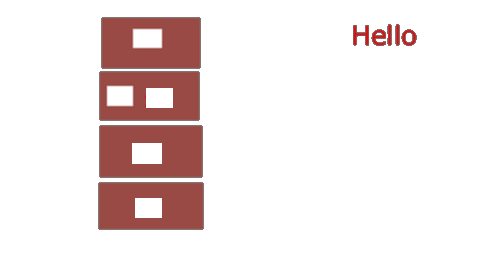

<h1> Python Class Notes</h1>

[Shared Markdown Library](aDoc/myIcons.md)

- [Markdown](#markdown)
- [Language Basics](#language-basics)
  - [Data Type](#data-type)
  - [Operator](#operator)
  - [Execution Control](#execution-control)
  - [Loop](#loop)
- [Function](#function)
  - [define function in function](#define-function-in-function)
  - [return function from function](#return-function-from-function)
  - [pass function as argument](#pass-function-as-argument)
  - [recursive function](#recursive-function)
  - [function decorator](#function-decorator)
  - [algorithms](#algorithms)
- [Class](#class)
  - [Python Interface](#python-interface)
- [References](#references)
  - [YouTube Tutorial](#youtube-tutorial)


## Markdown 
[Markdown Tricks](markdownTricks.md)
* Homeworks
  - [markdown-01](../homeworks/markdown01.md)
  - [markdown-02](../homeworks/markdown02.md)
  
## Language Basics
* [print.py](src/languageBasics/print.py)
  - Homeworks
    [print-01](homeworks/print01.md)
    [print-02](homeworks/print02.md)

* [variable.py](src/languageBasics/print.py)


  - Homeworks
    [variable-01](homeworks/variable01.md)
    [variable-02](homeworks/variable02.md)
    [variable-03](homeworks/variable03.md)


### Data Type
* Number (int, float, complex)
[number.py](../src/number.py)
  - Homeworks
    [number-01](../homeworks/number01.md)

* String
[string.py](../src/string.py)
  - Homeworks
    [string-01](../homeworks/string01.md)
    [string-02](../homeworks/string02.md)
    [string-03](../homeworks/string03.md)
    [string-03](../homeworks/string04.md)

* Tuple
[tuple.py](../src/tuple.py)

* List
  - Homeworks
    [list-01](../homeworks/list01.md)
    [list-02](../homeworks/list02.md)

* Set
[set.py](../src/set.py)

* Dictionary
[dictionary.py](../src/dictionary.py)

### Operator
* [operator.py](src/languageBasics/operator.py)
* [arithmatic.py](src/languageBasics/operator/arithmatic.py)
* [assignment.py](src/languageBasics/operator/assignment.py)
* [comparison.py](src/languageBasics/operator/comparison.py)
* [logical.py](src/languageBasics/operator/logical.py)
* [bitwise.py](src/languageBasics/operator/bitwise.py)
* [identity.py](src/languageBasics/operator/identity.py)
* [membership.py](src/languageBasics/operator/membership.py)
* [ternary.py](src/languageBasics/if-else/ternary.py)
* [others.py](src/languageBasics/operator/others.py)
  - Homeworks
    []()

### Execution Control
* [if](src/languageBasics/if-else/if-else01.py)
* [if-else, if-elif-else](src/languageBasics/if-else/if-else02.py)


* [User input](src/languageBasics/if-else/if-else03.py)
  - Homeworks
    [ifelss-01](homeworks/ifelse01.md)
    [ifelss-02](homeworks/ifelse02.md)
    
### Loop
* [for1.py](src/languageBasics/loop/for1.py)
* [for2.py](src/languageBasics/loop/for2.py)
* [forBreak.py](src/languageBasics/loop/forBreak.py)
* [forContinue.py](src/languageBasics/loop/forContinue.py)
  

* [while.py]()
  
  
  - Homeworks
    [loop-01](homeworks/loop01.md)
    [loop-02](homeworks/loop02.md)
    [loop-03](homeworks/loop03.md)
    [loop-04](homeworks/loop04.md)
    [loop-05](homeworks/loop05.md)

## Function
* [function arguments](src/function/defineFunction.py)

```use python playground
>>> from src.function.defineFunction import *
>>> help(f)
```
* [One time assign default value](src/function/defaultValue.py)
* [Simple math function](src/function/circle.py)
* [collision.py](src/function/collision.py)
* [check user input](src/function/ask.py)
* [access function attribute](src/function/attribute.py)
* [simple math function](src/function/math1.py)
* [optionalKeywordArgs.py](src/function/optionalKeywordArgs.py)
* [optionalPositionalArgs.py](src/function/optionalPositionalArgs.py)
### define function in function
* [funcInFunc.py](src/function/funcInFunc.py)
* [innerFunction01.py](src/function/innerFunction01.py)
* [innerFunction02.py](src/function/innerFunction02.py)
### return function from function
* [dynamicall generated quadratic function](src/function/returnFunction.py)
### pass function as argument
* [passFuncAsArg.py](src/function/passFuncAsArg.py)
### recursive function
A function is recursive if it calls itself.
  1. termination condition.
  2. adjust status for each call.
  3. Python stops the cunction calls after a depth of 1000 calls.
* [factoria.py](src/function/factorial.py)
$$ f(n) = n! = n (n-1) (n-2)\cdots1$$

* [recursiveBinarySearch.py](src/algorithms/recursiveBinarySearch.py)

* Understand recursive find.
  ```mermaid
  graph TB
  START((find answer))
  END[end]
  B[add 10 to<br>the answer of<br>problem 52]
  C[Problem 52:<br>Add 12 to<br>the answer of<br>problem 85]
  D[Problem 85:<br>10]
  
  START-->B-->C-->D
  D--10+12-->C--22+10-->B--32-->END

  classDef html fill:#F46624,stroke:#F46624,stroke-width:4px,color:white;
  classDef js fill:yellow,stroke:#DE9E1F,stroke-width:2px;
  classDef start fill:green,stroke:#DE9E1F,stroke-width:2px;
  classDef end1 fill:red,stroke:#DE9E1F,stroke-width:2px;
  class START start
  class B,C,D html
  class END end1
  ```
### function decorator
* [my_timer.py](src/function/my_timer.py)
### algorithms
Big O
* O(n)
* O(log n)
* [linearSearch.py](src/algorithms/linearSearch.py)
* [binarySearch.py](src/algorithms/binarySearch.py)
  
Operations on Data Structure
1. Access and read values
2. Search for an arbitrary values
3. Insert values at any point into the structure
4. Delete the value in the Data Structure
* [arrays.py](src/algorithms/arrays.py)

## Class
4 Features of OOP
1. Abstraction（抽象性==》实体模拟）
2. Inheritance（继承性==》属性及功能的继承）
3. Polymorphism（多样性==》多类型同功能调用，same function behavior differently by different object type）
4. Encapsulation (封装性==》属性自我保护)


* [class01.py](src/class/class01.py)
* [class02.py](src/class/class02.py)
* [class03.py](src/class/class03.py)
* [class04.py](src/class/class04.py)
* [class05.py](src/class/class05.py)
* [class06.py](src/class/class06.py)
* [class07.py](src/class/class07.py)
* [class08.py](src/class/class08.py)
* [class09.py](src/class/class09.py)
* [class10.py](src/class/class10.py)
* [class11.py](src/class/class11.py)
* [class12.py](src/class/class12.py)
* [class13.py](src/class/class13.py)
* [class14.py](src/class/class14.py)
* [class15.py](src/class/class15.py)
* [class16.py](src/class/class16.py)
* [class17.py](src/class/class17.py)
* [class18.py](src/class/class18.py)
* [class19.py](src/class/class19.py)
* [class20.py](src/class/class20.py)
* [class21.py](src/class/class21.py)
* [class22.py](src/class/class22.py)
* [class23.py](src/class/class23.py)
### Python Interface
[@abstractmethod](https://docs.python.org/3/library/abc.html)
[interface.py](src/class/interface.py)


* @abstractmethod decorator from abc
* __subclasshook__(), __subclasscheck__(), issubclass(), isinstance()

## References
* [python.md](aDoc/python.md)
* [VS Code Tricks](aDoc/vscodeTricks.md)
* [Markdown Tricks](aDoc/markdownTricks.md)
* [Keyboard](aDoc/keyboard.md)
* [Excercise](https://pynative.com/python-exercises-with-solutions/)
* [Function Excercises](https://pynative.com/python-functions-exercise-with-solutions/)

### YouTube Tutorial
* [Algorithms and Data Structure](https://www.youtube.com/watch?v=8hly31xKli0)
