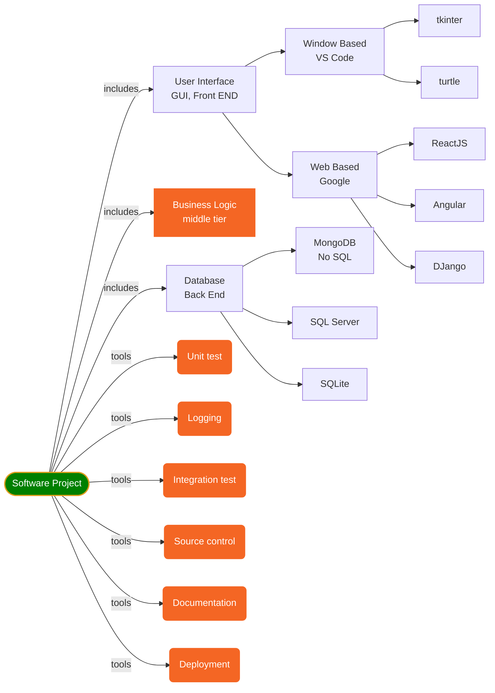
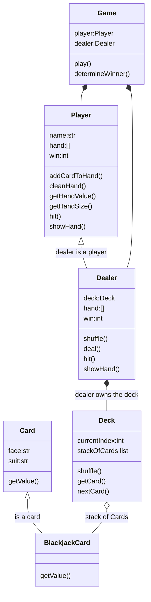
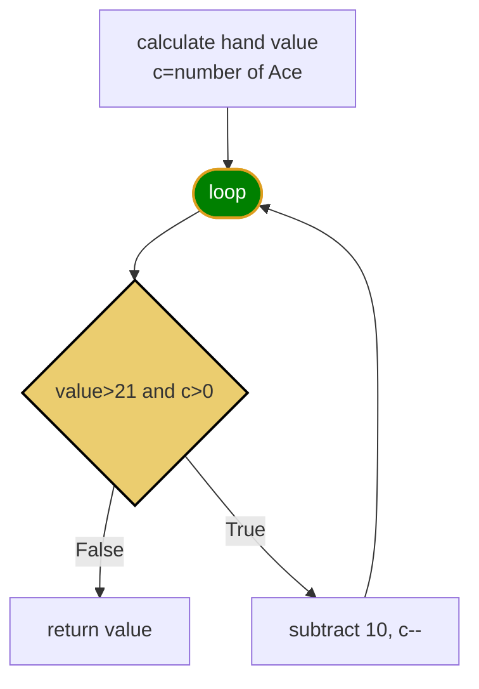
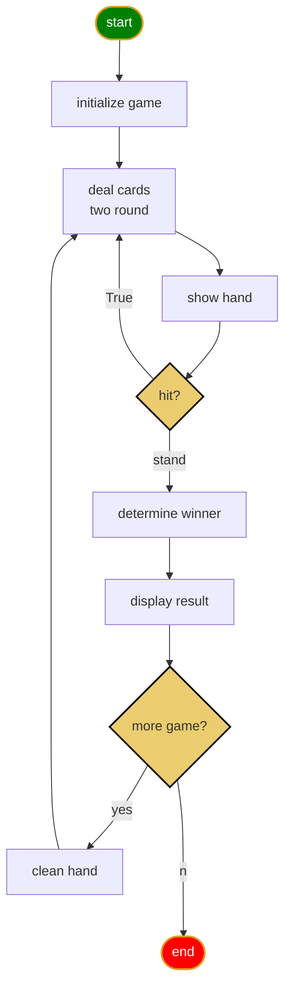
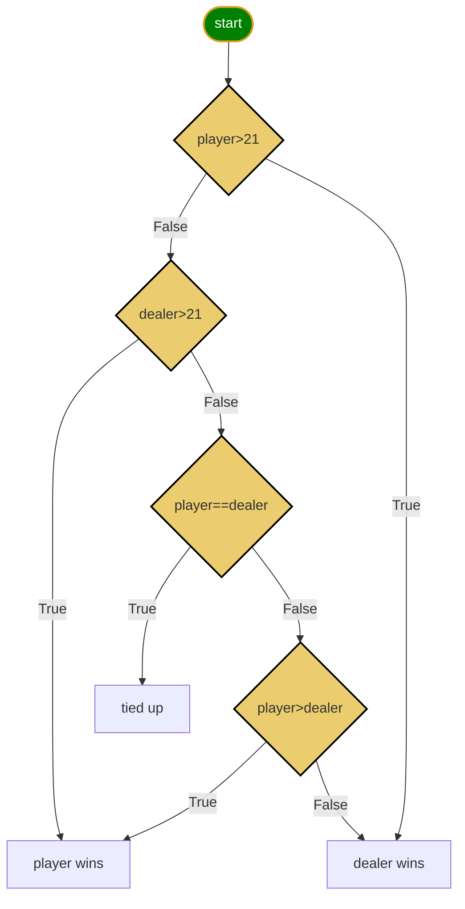

<h1>Python Language</h1>

Python programming continue I.

[Markdown Shared Library](myIcons.md)
- [Software Development](#software-development)
- [Unit Test](#unit-test)
- [Logging](#logging)
- [Blackjack Card Game](#blackjack-card-game)
  - [Blackjack Rules](#blackjack-rules)
  - [getHandValue()](#gethandvalue)
  - [Game Play Logic](#game-play-logic)
  - [missing unit tests](#missing-unit-tests)
  - [use logging in Blackjack](#use-logging-in-blackjack)
- [Documentation](#documentation)
  - [document for developer](#document-for-developer)
  - [Document for player (user)](#document-for-player-user)
- [Data Structure](#data-structure)
  - [stack](#stack)
- [Deployment](#deployment)


## Software Development

* Software development must include the following parts at lease.

❓How do I adjust a good software?
✔️👍Performance!!!👍1. correct; 2. fast.


## Unit Test
❓What is unit test?
>✔️A unit is a specific piece of code need to be tested, such as a function or a class.  in our sample code, circleArea() function is a code unit. The Unit test are then other piece of code that specifically exercise the code unit with a **full range** of different inputs.

❓How do I configure the unit test in Python?
✔️Right-click ⟹ Command Palette... ⟹ Configure Tests ⟹ unittest ⟹ test ⟹ test_*.py

❓How do I run unittest?
✔️

[Test Circle area calculation](../test/test_circleArea.py)

## Logging
❓What is logging?
✔️write software execution record to console, file or database used for application analysis.
there are at least 5 level of logging: Debug, Info, Warning, Error, Fatal

[Out put log message to a file](../src/logging1.py)


## Blackjack Card Game
* [Blackjack Rules](https://bicyclecards.com/how-to-play/blackjack/)
### Blackjack Rules
1. Objective of the game: 
>Beat the dealer by getting a count as close to 21 as possible, without going over 21
2. Card Values 
>Ace is worth 1 or 11, J,Q,K are 10, other card is its pip value
3. Betting
>For simplicity, we don't bet.
4. Shuffle and cut
>The dealer shuffles the pack of card, no need player cut
5. Deal
>The dealer gives one card face up to each player, and one card face up for himself. Another round of cards is then dealt face up to each player, but the dealer takes the second card face down.
6. Naturals
>If a player's first two cards are an ace and a "ten-card" (a picture card or 10), giving a count of 21 in two cards, this is a natural or "blackjack." If any player has a natural and the dealer does not, the dealer loses.  If the dealer has a natural, other doesn't, dealer win. If both dealer and player have natural, nobody wins.
7. The Play
>Any player on his turn must decide whether to "stand" (not ask for another card) or "hit" (ask for another card in an attempt to get closer to a count of 21, or even hit 21 exactly). Thus, a player may stand on the two cards originally dealt to them, or they may ask the dealer for additional cards, one at a time, until deciding to stand on the total (if it is 21 or under), or goes "bust" (if it is over 21). In the latter case, play loses the game. The dealer then turns to the next player and serves them in the same manner. The combination of an ace with a card other than a ten-card is known as a "soft hand," because the player can count the ace as a 1 or 11, and either draw cards or not. For example with a "soft 17" (an ace and a 6), the total is 7 or 17. While a count of 17 is a good hand, the player may wish to draw for a higher total. If the draw creates a bust hand by counting the ace as an 11, the player simply counts the ace as a 1 and continues playing by standing or "hitting" (asking the dealer for additional cards, one at a time).
8. The Dealer's Play
>When the dealer has served every player, the dealers face-down card is turned up. If the total is 17 or more, it must stand. If the total is 16 or under, they must take a card. The dealer must continue to take cards until the total is 17 or more, at which point the dealer must stand. If the dealer has an ace, and counting it as 11 would bring the total to 17 or more (but not over 21), the dealer must count the ace as 11 and stand. The dealer's decisions, then, are automatic on all plays, whereas the player always has the option of taking one or more cards.
9. No Splitting Pairs
10. No Doubing Down
11. No Insurance
12. Reshuffling when start new game.



[blackjack card game](../src/blackjack.py)
* Card
* BlackjackCard
* Deck
* Player
* Dealer
* Game

[Unit test](../test/test_blackjack.py)

### getHandValue()


❌👇Wrong code below, only handle 1 Ace!😢
```py
    def getHandValue(self):
        value = 0
        for card in self.hand:
            value += card.getValue()
        if value > 21 and self.hasAce(): # A=11,
            value -= 10 # change A=1
        return value

    def hasAce(self):
        for card in self.hand:
            if card.face == 'A':
                return True
        return False # return False till check every card in hand

```
✔️👇Better solution, handle 1,2,3,4 Aces in one player hand.😄
```py
  def getHandValue(self):
    value = 0
    for card in self.hand:
        value += card.getValue()
    a = self.numberAce()
    while value > 21 and a>0: # A=11,
        value -= 10 # change A=1
        a -= 1
    return value

  def numberAce(self):
    count = 0; 
    for card in self.hand:
        if card.face == 'A':
            count += 1
    return count # return number of Ace in hand

```
### Game Play Logic



* determine winner


### missing unit tests
1. player holds 1 Ace busted
2. player holds 1 Ace without busted
3. player holds 2 Aces
4. player holds 3 Aces
5. player holds 4 Aces (may never happens in integration test)

### use logging in Blackjack
1. copy logger code from logging1.py under Game class
```py
import logging

    LOG_FORMAT = "%(asctime)s %(levelname)8s - %(message)s"
    logging.basicConfig(filename=r"/Users/12818/workspace/python1/blackjack.log", level=logging.DEBUG, format=LOG_FORMAT)

    logger = logging.getLogger("Huaxia")
```
2. we add logger.debug() or logger.info() in our function.
3. change level on demands
```py
    logging.basicConfig(filename=r"/Users/12818/workspace/python1/blackjack.log", level=logging.INFO, format=LOG_FORMAT)
```

## Documentation
### document for developer
❓How do I open the python document for my blackjack game?
✔️Open Python playground ⟹ import src.blackjack as bj ⟹ help(bj)

❓How do I open Python playground?
✔️open a new terminal, type in python
```output
(env) C:\Users\12818\workspace\python1>python
Python 3.9.1 (tags/v3.9.1:1e5d33e, Dec  7 2020, 17:08:21) [MSC v.1927 64 bit (AMD64)] on win32
Type "help", "copyright", "credits" or "license" for more information.
>>>
```

❓How do I see document of function or class in blackjack module?
1. class
✔️Open Python playground ⟹ from src.blackjack import * ⟹ help(Card)
2. function
✔️Open Python playground ⟹ from src.blackjack import * ⟹ help(winner)
3. function in class
✔️Open Python playground ⟹ from src.blackjack import * ⟹ help(Game.play) 

### Document for player (user)
[Blackjack.md](blackjack.md)

## Data Structure
### stack
❓What is stack?
✔️a stack is an abstract data type that serves as a collection of elements, with two main principal operations: (LIFO) last in first out.
1. Push, which adds an element to the collection, and
2. Pop, which removes the most recently added element that was not yet removed.
you have list of element, stack each other.
* [stack.py](../src/stack.py)

## Deployment
1. open github > create new repository called "blackjack"
2. run the following command
```DOS
git clone https://github.com/jwang1122/blackjack.git
```
3. copy python files to the blackjack folder
4. push your source code to gitHub