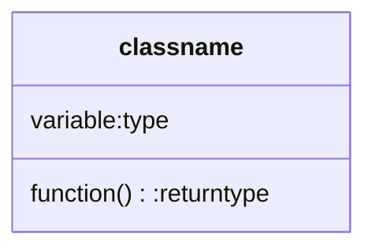
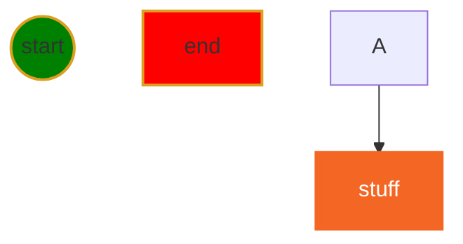

# VSCode Tricks

[](myIcons.md)
## Syntax Error due to run python code in playground
trash the terminal > run program again
❗️never use your running terminal for playground.

## recover wrong typing
Ctrl+z

## open terminal

## open python playground
```DOS
python
```
I will get prompt below
```
C:\Users\12818\workspace\python1>python
Python 3.9.1 (tags/v3.9.1:1e5d33e, Dec  7 2020, 17:08:21) [MSC v.1927 64 bit (AMD64)] on win32
Type "help", "copyright", "credits" or "license" for more information.
>>>
```

## Save File
* File menu ⟹ Save All
* Ctrl+s

## Create shorcut for complex code block
* create python code shortcut
Right-Click in Editor window ⟹ Command Palettes ⟹ Configure User Snippets ⟹ python.json

* create markdown code block shortcut
Right-Click in Editor window ⟹ Command Palettes ⟹ Configure User Snippets ⟹ markdown.json



# 

