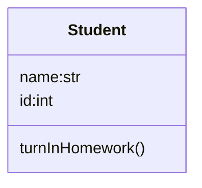

# Python Homework

1. Find the answer for "what are the differences between class and function?".

Hints: python > help() > topics > CLASSES

You can also search online for the answer.

2. Define a student class based on the image below.

3. Define a function that calculate circle area.

4. write a test program to test your student class and area calculation function.