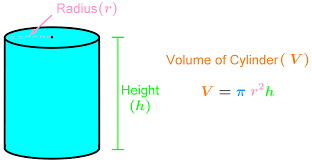

# Define a function calculate volume of cylinder by given radius and height.



```py
def cylinderVolume(radius, height):
    # your code here
```

Expected result:

The circle area with radius=1 and height=2 is ...