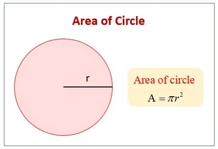

* Write a Python program to calculate circle circumference with given radius. Display the circumference with only 3 decimal points.

$$ A = 2 \pi r $$

For given radius = 3

Expected output:

The circle circumference with radius=3 is 18.850.

