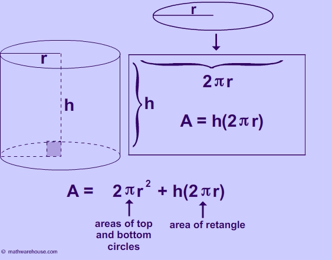

* Write a Python program to calculate surface area of a cylinder. 



$$ A = 2 \pi r^2 + h(2\pi r) $$

Expected output:

```
Height of cylinder: 4
Radius of cylinder: 6

Volume is: 452.389
Surface Area is: 376.991
```