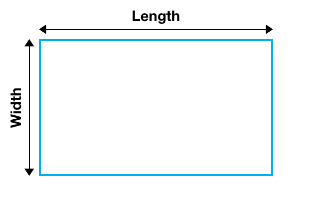

* Write a Python program to calculate primeter of a rectangle with given width and length. 



>$$ A = length \cdot width  $$

Expected output:

```output
Calculate area of a rectagle:

length = 4
width = 6

area = 24 
```