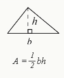

* Write a Python program to calculate area of a triangle with given base and height. 



>$$ A = \frac 1 2 b \cdot h  $$

Expected output:

```output
Calculate area of a triangle:

base = 6
height = 4

area = 12 
```